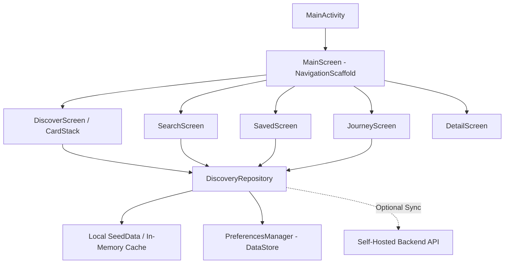

# Phils - Intellectual Discovery Feed

<div align="center">

> *"Don't make people stop scrolling. Make the scrolling worth doing."*

[](https://developer.android.com)
[](https://kotlinlang.org)
[](https://developer.android.com/jetpack/compose)
[](https://nodejs.org)
[](https://www.postgresql.org)
[](https://www.docker.com)
[](LICENSE)

An editorial mobile application designed to replace mindless short-form entertainment feeds with curiosity-driven intellectual discovery. Swipe vertically through philosophies, paradoxes, cognitive biases, thought experiments, and timeless ideas.

[Overview](#-overview) •
[Features](#-features) •
[Repository Structure](#-repository-structure) •
[Quick Start](#-quick-start) •
[Architecture](#-architecture) •
[API Reference](#-api-reference) •
[Design System](#-design-system)

</div>

---

## 💡 Overview

Modern social feeds make consuming content effortless, but optimize for repetitive engagement and entertainment. Traditional educational platforms require users to deliberately commit to structured courses, textbooks, or long articles.

**Phils** bridges these two worlds. It pairs the natural, friction-free interaction model of modern feeds:

$$\text{Open} \longrightarrow \text{Swipe} \longrightarrow \text{Discover} \longrightarrow \text{Swipe} \longrightarrow \text{Discover}$$

...with bite-sized, intellectually stimulating ideas designed to spark genuine curiosity.

Every discovery is crafted around the **"Discovery Before Depth"** principle: presenting an intriguing question or premise first, followed by clear, approachable insights, and optional deep-dive exploration.

---

## ✨ Features

### 📱 100% Native Android App
- **Jetpack Compose UI**: Smooth 60/120 FPS declarative UI built with modern Material 3 and custom editorial layouts.
- **Editorial Asymmetric Card Stack**: Gesture-driven 3D physics swipe interactions with tilt, scale, and velocity-sensitive dismissal.
- **10 Dynamic Mood Palettes**: Dynamically tints each card based on domain (Obsidian Dark, Terracotta Ethics, Sage Epistemology, Indigo Metaphysics, Amber Stoic, Forest Logic, Crimson Existential, Slate Nihilism, Dusky Aesthetic, Classic Parchment).
- **Edge-to-Edge Navigation**: Native `navigationBarsPadding()` and `statusBarsPadding()` support ensuring zero overlap with Android system gestures or 3-button navigation bars.
- **Offline-First Resilience**: Pre-seeded with timeless philosophies that work anywhere, anytime, without requiring an active internet connection.
- **Interactive "Why" Sheet**: Total algorithmic transparency. Tap the recommendation tag on any card to see exactly why it appeared on your feed.
- **Search & Filter**: Instant search across 18+ intellectual domains, thinkers, and historical eras.
- **Journey & Saved Vault**: Bookmark your favorite discoveries and track your intellectual exploration history with persistent DataStore storage.

### 🚀 Self-Hosted Backend API
- **Full Privacy & Data Ownership**: Zero external trackers, zero advertising, zero third-party telemetry.
- **Recommendation Engine**: Balances curiosity exploration with affinity weighting based on saved cards, reading dwell time, and user interaction history.
- **Turnkey Deployment**: Preconfigured `docker-compose.yml` for single-command production deployment with PostgreSQL 16.

---

## 📂 Repository Structure

The codebase is organized into clear, modular sub-projects:

```
phils/
├── android/                    # 📱 100% Native Android Mobile App
│   ├── app/
│   │   ├── src/
│   │   │   ├── main/
│   │   │   │   ├── java/com/phils/app/
│   │   │   │   │   ├── data/          # DiscoveryRepository & PreferencesManager (DataStore)
│   │   │   │   │   ├── model/         # Discovery data models & SeedData collections
│   │   │   │   │   ├── theme/         # 10 editorial mood color palettes & typography
│   │   │   │   │   ├── ui/
│   │   │   │   │   │   ├── components/ # BottomBar, CatalogCorner, MiniCard, WhySheet
│   │   │   │   │   │   ├── detail/     # Long-form reading & deep-dive screen
│   │   │   │   │   │   ├── feed/       # Asymmetric 3D CardStack & FeedScreen
│   │   │   │   │   │   ├── journey/    # Exploration stats & history
│   │   │   │   │   │   ├── saved/      # Bookmarked discoveries collection
│   │   │   │   │   │   ├── search/     # Instant search & category filtering
│   │   │   │   │   │   └── MainScreen.kt # Root navigation & scaffold
│   │   │   │   │   └── MainActivity.kt # Edge-to-edge Android entry point
│   │   │   │   └── res/               # Icons, drawables, splash assets, XML configs
│   │   │   └── test/                  # Unit and instrumented tests
│   │   └── build.gradle               # App-level dependencies & Compose configuration
│   ├── gradle/wrapper/                # Gradle wrapper binaries & properties (8.11.1)
│   ├── build.gradle                   # Project-level build script
│   └── settings.gradle                # Declarative plugin management
│
├── server/                     # 🚀 Self-Hosted Backend REST API
│   ├── src/
│   │   ├── db/
│   │   │   ├── discoveriesData.ts     # Pre-seeded database of intellectual concepts
│   │   │   ├── schema.sql             # PostgreSQL schema (discoveries, interactions, saves)
│   │   │   └── store.ts               # Data store & query abstractions
│   │   ├── services/
│   │   │   └── recommendationEngine.ts # Affinity-weighted recommendation algorithm
│   │   ├── index.ts                   # Express REST endpoints & health check
│   │   └── types.ts                   # TypeScript interfaces
│   ├── Dockerfile                     # Multi-stage container build
│   ├── package.json                   # Server dependencies
│   └── tsconfig.json
│
├── docker-compose.yml          # 🐳 Production container orchestration (PostgreSQL + API)
├── package.json                # 🛠️ Root workspace helper scripts
├── LICENSE                     # 📄 MIT License
└── README.md                   # 📖 Documentation
```

---

## 🚀 Quick Start

### 1. Prerequisites

- **Android App**: Android Studio (Koala / Ladybug or newer), Android SDK 35, JDK 17.
- **Backend Server**: Node.js 18+ and npm (or Docker).

---

### 2. Running the Native Android App

1. Open **Android Studio**.
2. Select **Open** and choose the `phils/android` directory (⚠️ *important: open the `android` subfolder, not the project root*).
3. Wait for Gradle to sync.
4. Click **Run** (`Shift + F10`) to launch on your connected Android device or emulator.

Alternatively, build from command line:
```bash
# On Windows PowerShell
cd android
.\gradlew.bat assembleDebug

# On macOS / Linux
cd android
./gradlew assembleDebug
```
The resulting APK will be generated at:
`android/app/build/outputs/apk/debug/app-debug.apk`

---

### 3. Running the Self-Hosted Server

#### Option A: With Docker Compose (Recommended)
```bash
docker compose up -d
```
The API will be live at `http://localhost:3000` with PostgreSQL automatically initialized.

#### Option B: With Node.js directly
```bash
cd server
npm install
npm run dev
```

Test that the server is active:
```bash
curl http://localhost:3000/health
# Response: {"status":"ok","product":"Phils API","version":"1.0"}
```

---

### 4. Root Workspace Helper Commands

From the repository root, you can run convenience scripts:

| Command | Action |
|---|---|
| `npm run dev` | Start backend API in hot-reload mode |
| `npm run build:server` | Compile backend TypeScript |
| `npm run android:build` | Build Android debug APK |
| `npm run android:install` | Build and install debug APK onto device |
| `npm run docker:up` | Launch PostgreSQL + Backend containers |
| `npm run docker:down` | Stop Docker containers |

---

## 📐 Architecture

### Android Architecture


- **Declarative Navigation**: Tab transitions between Feed, Search, Saved, and Journey with fluid state preservation.
- **Edge-to-Edge System Bars**: Transparent status bar and system navigation bar with proper Compose insets (`WindowInsets.navigationBars`, `WindowInsets.statusBars`).
- **DataStore Storage**: Bookmarked discovery IDs and theme preferences persist reliably across app restarts.
- **Modular Design Tokens**: Palette colors (`Obsidian`, `Sage`, `Terracotta`, `Indigo`, `Amber`, `Forest`, `Crimson`, `Parchment`, `Dusky`, `Slate`) adapt seamlessly between light and dark modes.

---

## 📡 API Reference

| Method | Endpoint | Description |
|---|---|---|
| `GET` | `/health` | Healthcheck and service version |
| `GET` | `/api/v1/feed?limit=15` | Fetch personalized discovery feed cards |
| `GET` | `/api/v1/discoveries/:id` | Fetch full discovery content, quote, and key ideas |
| `POST` | `/api/v1/interactions` | Record dwell time, card skip, or click-through |
| `GET` | `/api/v1/search?q=:query` | Search across titles, thinkers, and categories |
| `GET` | `/api/v1/user/saved` | Retrieve user's bookmarked discoveries |
| `POST` | `/api/v1/user/saved/:id` | Toggle save/bookmark state for a discovery |
| `GET` | `/api/v1/user/history` | Retrieve user's recently explored cards |

---

## 🎨 Design System

Phils combines the timeless authority of classical editorial publishing with the fluidity of modern gesture navigation:

- **Typography**: Editorial serifs for headlines and contemplative concepts; high-contrast monospace fonts for metadata eyebrows and catalog numbers.
- **Palette Identity**:
  - **Stoicism & Logic**: Cool Amber (`#D97706`), Forest Green (`#059669`)
  - **Epistemology & Science**: Sage (`#10B981`), Crisp Teal (`#0D9488`)
  - **Existentialism & Ethics**: Terracotta (`#C2410C`), Crimson (`#DC2626`)
  - **Metaphysics & Paradoxes**: Indigo (`#6366F1`), Midnight Obsidian (`#18181B`)

---

## 📄 License

This project is licensed under the MIT License - see the [LICENSE](LICENSE) file for details.
